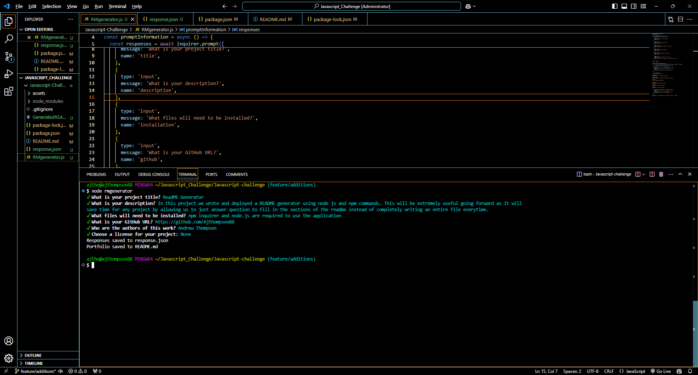

# ReadME Generator

## Description
In this project we wrote and deployed a README generator using node js and npm commands. This will be extremely useful going forward as it will save time for any project by allowing us to just answer question to fill in the sections of the readme instead of completely writing an entire file everytime.

## Installation
npm inquirer and node.js are required to use the application

## Usage

## Deployment
https://github.com/Ajthompson88

## Authors
Andrew Thompson

## License
None
